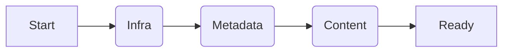

# The GitOps Bootstrap Roadmap (Visual)

## Phase 1: Infrastructure (Day 0)
1.  **Repository Creation**: `glass-factory sync-github`
2.  **Branch Protection**: `main` locked
3.  **Secrets Injection**: `GH_TOKEN`, `NPM_TOKEN`

## Phase 2: Metadata Injection
1.  **Labels**: 45 standard labels applied
2.  **Milestones**: `M001-Genesis` created
3.  **Project Board**: Linked to "Core Engineering"

## Phase 3: Content
1.  **README**: Standard header
2.  **Charter**: Vision defined
3.  **Codebase**: `src/` scaffolded

