# The GitOps Bootstrap Roadmap (Visual)

This roadmap defines the **Non-Negotiable Sequence** for initializing any new initiative in the Agentic Ecosystem.

## Phase 1: The Container (Infrastructure)


## Phase 2: The Spine (Project Metadata)
*Critical: Providing the structural integrity before content injection.*

```mermaid
graph TD
    A[✅ INFRASTRUCTURE READY] --> B[Create Project Board V2]
    B --> C[🛑 STOP: Manual Configuration Required]
    C --> C1[Add Field: Status (Todo, In Review, Done)]
    C --> C2[Add Field: Priority (Critical, High, Med, Low)]
    C --> C3[Add Field: Type (Epic, Story, Task)]
    C3 --> D[Fetch Global IDs via `gh project field-list`]
    D --> E[Update Global Metadata / Script Config]
    E --> F[✅ SPINE READY]
```

## Phase 3: The Roadmap (Time & Scope)
*Source of Truth: Local `/planned/` Folder*

```mermaid
graph TD
    A[✅ SPINE READY] --> B[Define Milestones]
    B --> C[Create 3-Digit Milestones on GitHub (M001, M002...)]
    C --> D[Create Local Folders]
    D --> D1[standards-factory/github-issues/planned/m001-consolidation]
    D1 --> E[Create Epic Files (100 Series)]
    E --> F[Create Task Files (001 Series)]
    F --> G[✅ LOCAL TRUTH READY]
```

## Phase 4: The Injection (Sync)
*The First Breath of Life*

```mermaid
graph TD
    A[✅ LOCAL TRUTH READY] --> B[Verify Titles & Assignees]
    B --> C[Ensure Script uses `--state all` (Prevent Zombies)]
    C --> D[Run `sync-smart-metadata.sh`]
    D --> E{Sync Success?}
    E -- Errors --> F[Fix Local Metadata]
    F --> D
    E -- Success --> G[Verify Project Board]
    G --> H[✅ PROJECT LIVE]
```

## Phase 5: The Work (Implementation)
*Only NOW do we touch the code.*

```mermaid
graph TD
    A[✅ PROJECT LIVE] --> B[Pick Task from Board]
    B --> C[Create Branch `feat/issue-number-name`]
    C --> D[Code / Write Documents]
    D --> E[PR & Merge]
    E --> F[Close Issue]
```


